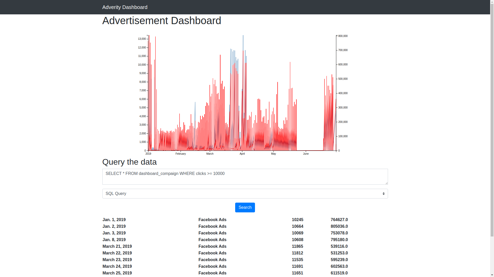

# Django Advertisement Application

Django application for advertisement monitoring

## Usage

- ```/``` the index of the application with the dashboard
- ```populate/``` to populate the database
- ```fetch_all/``` to fetch all the objects in the database
- ```search/``` to query the database

 

- **Note**: Dates where we have insuffisent data have been ommited in this graph to not have incomplete data in the visualization.